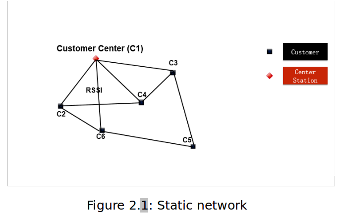

# WirelessSensorNetwrok_static_routing
implement static routing wireless sensor network for drone dilivery 

## details description 
In this project, the static routing plays an important and indispensable role because it is responsible for communication between the center and customer. Although our network is static, that means every mote cannot move, at the beginning no mote even the center knows the surrounding around itself. So in order to find a shortest path between two motes, we should firstly collect the surrounding information around every mote. Clearly speaking, the surrounding information of the mote is the weight of the paths which connect this mote and other reachable mote. After collecting all feasible weights, we can construct an adjacent matrix which describes our static network. In this project, we choose the absolute value of RSSI as the entries of this matrix because it is easy to obtain and calculate. At the same time, it can represent the difficulty level of different paths. The collection of adjacent matrix will be done by the center and then it will be broadcasted to all the customer mote. After that, every mote can calculate its own shortest path to every mote using Dijkstra method. This feature is useful for failure recovery with real time requirement which will be mentioned in the following chapter.  Additionally, in this project, the force sensor connected with the customer is used to generate a request for helicopter. When this force sensor of e.g. customer 5 is pressed, it means that customer 5 wants a helicopter to come, so he/she sends a request to the center using unicast based on the shortest path. When the center receives this request it will send an acknowledgment back to customer using unicast based on the shortest path it has calculated. At the same time, it will communicate with the dynamic part for calling an available helicopter to do this task for customer 5. The dynamic part will be explained in the third chapter.

